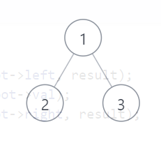

**算法：判断两树是否相同的方法有很多，这里采用 判断前序遍历和中序遍历的方法：由于前序遍历和中序遍历能唯一确定一棵树，因此如果两棵树的前序遍历和中序遍历结果均相同，那么两树相同，否则不相同。<font color = red>另外需要注意的是：</font>在进行遍历时，遇到空结点不能直接返回，而应该在要返回的全局变量（如下面算法中的result）中插入一个0，表示一个空结点，这样做是为了防止遇到这样一种情况--两棵树的结构不同，但是两棵树的节点数相同，且节点的val值也都相同。此时如果遇到空结点时不插入一个0，则无法判断。**   
**<font color = green>我的答案 AC</font>**
```
/**
 * Definition for a binary tree node.
 * struct TreeNode {
 *     int val;
 *     TreeNode *left;
 *     TreeNode *right;
 *     TreeNode() : val(0), left(nullptr), right(nullptr) {}
 *     TreeNode(int x) : val(x), left(nullptr), right(nullptr) {}
 *     TreeNode(int x, TreeNode *left, TreeNode *right) : val(x), left(left), right(right) {}
 * };
 */
class Solution { //判断两棵树是否相同的其中一种方法是看两棵树的前序遍历和中序遍历结果是否均相同，如果相同则两树相同，否则不相同。
public:
    vector<int>& PreOrderTraverse(TreeNode* root, vector<int>& result)
    {//递归前序遍历
        if(root) //如果节点非空
        {
            result.push_back(root->val);
            PreOrderTraverse(root->left,result);
            PreOrderTraverse(root->right,result);
        }
        else //这里对空结点的处理不是直接返回，而是插入一个0，目的是为了防止两棵树节点数相同且节点的val值均相同的情况。
            result.push_back(0); 
        return result;

    }
     vector<int>& InOrderTraverse(TreeNode* root, vector<int>& result)
    {//递归中序遍历
        if(root)//同上
        {
            PreOrderTraverse(root->left,result);
            result.push_back(root->val);
            PreOrderTraverse(root->right,result);
        }
        else //同上
            result.push_back(0);  
        return result;
    }
    bool isSameTree(TreeNode* p, TreeNode* q) {
        vector<int> result_p_preOrder; //全局变量,用于存储遍历结果
        vector<int> result_p_inOrder; //同上
        vector<int> result_q_preOrder;//同上
        vector<int> result_q_inOrder;//同上
        result_p_preOrder = PreOrderTraverse(p, result_p_preOrder); //求p的前序遍历
        result_p_inOrder = InOrderTraverse(p, result_p_inOrder); //求p得中序遍历
        result_q_preOrder = PreOrderTraverse(q, result_q_preOrder);//求q的前序遍历
        result_q_inOrder = InOrderTraverse(q, result_q_inOrder);//求q的中序遍历
        //如果p的前序遍历等于q的前序遍历且p的中序遍历等于q的中序遍历，那么说明两树相同
        if((result_p_preOrder==result_q_preOrder)&&(result_p_inOrder==result_q_inOrder))
            return true;
        else //否则不相同
            return false;

    }
};
```

-----------------------------------------------------------------------------
## 2021.9.21更新
**上面的算法虽然可以通过，但是遍历的输出其实是有问题的**,例如输入的树为：    
   
其中序遍历输出为`2 0 0 1 3 0 0`，分析上面的中序遍历代码就可发现问题-- **在root为真时，要判断一次root是否为叶节点，若为叶节点，读取val值，再直接返回，不再递归。** 中序遍历应该修改成这样：   
```
vector<int>& InOrderTraverse(TreeNode* root, vector<int>& result)
{//递归中序遍历
    if(root) //同上
    {
        if(!root->left&&!root->right){ //如果是叶节点 直接读取val值，不再进行递归
            result.push_back(root->val);
            return result;
        }
        InOrderTraverse(root->left, result);
        result.push_back(root->val);
        InOrderTraverse(root->right, result);
    }
    else //同上
        result.push_back(0);  
    return result;
}
```