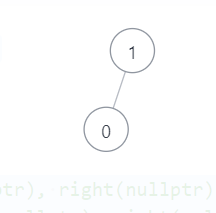
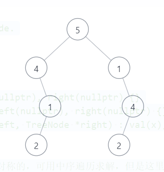

**算法：//判断一棵树是否是对称的，可用中序遍历求解，但是这里的中序遍历要稍作修改--如果一个要到一个非叶节点它的左孩子或右孩子为空，那么用100代替（之所以这样做是为了防止出现这样的情况：，而用100代替不用0代替是因为树中的节点val值可能也为0，见下面的情况1）。如果这棵树的中序遍历数组是对称的，那么这棵树可能对称，之所以说可能对称，是因为可能还会出现一类特殊情况--根节点的左右孩子val值不相等但是中序遍历数组是对称的（情况2）。因此必须要满足中序遍历数组对称且根节点的左右孩子（若存在）val值相等这两个条件才能称这棵树是对称的。**  
**情况1：**    
   
**情况2：**   


**<font color = green>我的答案 AC</font>**
```
/**
 * Definition for a binary tree node.
 * struct TreeNode {
 *     int val;
 *     TreeNode *left;
 *     TreeNode *right;
 *     TreeNode() : val(0), left(nullptr), right(nullptr) {}
 *     TreeNode(int x) : val(x), left(nullptr), right(nullptr) {}
 *     TreeNode(int x, TreeNode *left, TreeNode *right) : val(x), left(left), right(right) {}
 * };
 */
class Solution {
public:
    vector<int>& InOrder(TreeNode* root, vector<int>& result)
    {   
        if(root)
        {
            if(!root->left&&!root->right){ //如果是叶节点 直接读取val值，不再进行递归
                result.push_back(root->val);
                return result;
            }
            InOrder(root->left, result);
            result.push_back(root->val);
            InOrder(root->right, result);
        }
        else //如果非叶节点的一个孩子节点为空，那么插入100表示这个空的孩子节点
            result.push_back(100);
        return result;
    }
    bool isSymmetric(TreeNode* root) {
        vector<int> result, rev_result;
        result = InOrder(root, result);
        cout<<"InOrder Array："<<" ";
        cout<<endl;
        for(auto ite = result.begin(); ite!=result.end(); ite++)
            cout<<*ite<<" ";
        cout<<endl;
        rev_result = result;
        std::reverse(result.begin(), result.end());
        cout<<"Reverse InOrder Array："<<" "<<endl;
        for(auto ite = result.begin(); ite!=result.end(); ite++)
            cout<<*ite<<" ";
        if(root->left&&root->right&&(root->left->val!=root->right->val)) //条件一：如果根节点的左右孩子节点均存在，且val值不相等，那么不对称
            return false;
        if(result==rev_result)  //如果满足条件一，且中序遍历数组是对称的，那么这棵树对称
            return true;
        else  //否则，不对称
            return false; 
    }
};
```