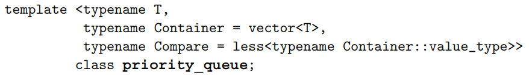
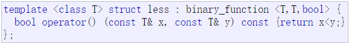

## 如何声明一个priority_queue?
```
class Solution {
public:
    struct Status {
        int val;
        ListNode *ptr;
        bool operator < (const Status &rhs) const {
            return val < rhs.val;
        }
    };

    priority_queue <Status> q;
```
看上面的这个代码段，我想做的是生成一个将元素`Status`按降序排列的priority_queue,由于`Status`是自定义的一个struct，我必须为其显示重载`<`运算符，否则，下图中`typename Compare = less<typename Container::value_type>>`这一行调用不了`operator <`.



-------------------------------------------------------------------------------------
&ensp;&ensp;另外，上面的priority_queue按照降序排列时`operator <`应该写成`return val<rhs.val`

## 参考文献
### 1.《The C++ Standard Library A Tutorial and Reference》    
#### 2. [Less](http://www.cplusplus.com/reference/functional/less/?kw=less)